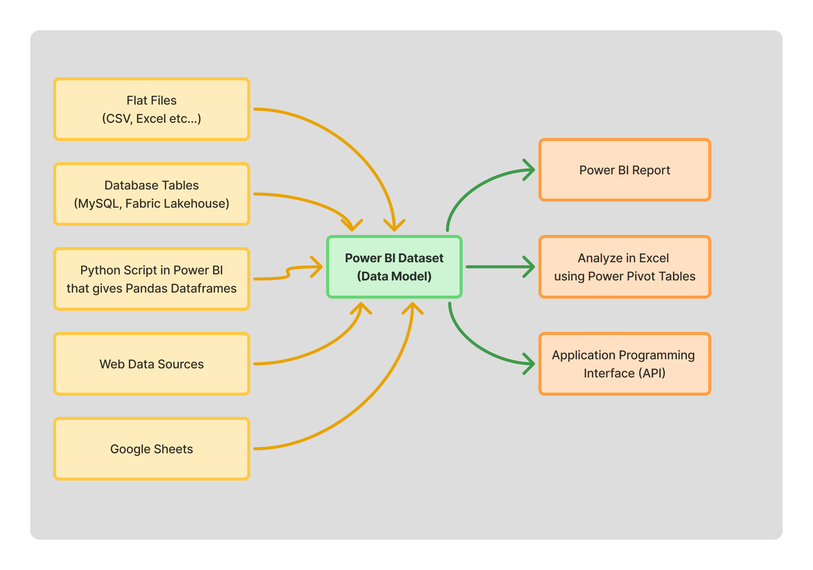

# Introduction

## Power BI Datasets

{: align=left }

This image shows the flow of data in the context of Power BI. Behind every Power BI Dashboard, there is an underlying **dataset**. The data from various sources is imported into this **dataset** as tables. This is the first step. We can import data from hundreds of various datasources and there are connectors available to do this. We don't have to know all of them and instead we use them on need basis depending on our scenario and data source.

A collection of tables is not a dataset. It is just a collection of tables. A dataset can be described as a well connected (through relationships) set of tables with additional augmented or custom columns, new derived tables from the source tables, measures, security roles and permissions and so on. The acronym **BI** in Power BI refers to Business Intelligence. These datasets are powering the **Business Intelligence**. 

!!! info "Measures"

    **Measure** is the techinical term used in DAX language that refers to formulas that compute results in real-time (not precomputed and stored) and the same measure or the formula will give different results depending on what filters or slicers we select in the report or how we filter data in a Power Pivot.

    It is "One Formula - Dynamic results based on the context"

### DAX

**DAX**, which stands for **D**ata **A**nalysis e**X**pressions, is the programming language of Microsoft Power BI, Microsoft Analysis Services, and Microsoft Power Pivot for Excel.

DAX will be used extensively in the process of dataset creation for adding calculated columns, creating calculated tables, authoring measures, composing queries for API fetches etc...

??? note "DAX Vs Excel Formulas"

    Though it is a programming language, it is mostly just functions (like excel formulas) and in some cases, we can use variables etc.. For people familiar with Excel or any other spreadsheets, learning DAX will be very easy. But there is one important difference here. Excel formulas work at a cell level. But DAX works at a column level. There is no concept of previous row or next row. 

## Power BI Desktop

A **dataset** can be created either using a **Power BI Desktop** software or directly on **Power BI Service** (The powerbi.microsoft.com portal). 

Through these tutorial sessions, we will be using **Power BI Desktop** software to create datasets and build reports.

??? info "Reports Vs Dashboards"

    There is a distinct difference between the terms **Reports** and **Dashboards** in the context of Power BI. Each report can have only one underlying dataset. A user can create a blank **Dashboard** and pin or populate this dashboard with visuals from many **Reports**. We will see more when we use them.

Let's get started. The first step is to install the Power BI Desktop software. The link is given below. There will be two installation files. Choose the one that is compatible with your computer's CPU. There are two files available.

- PBIDesktopSetup.exe
- PBIDesktopSetup_x64.exe

For most people who use Intel CPUs, the `x64` version will be the compatible version. 

[Download Power BI Desktop](https://www.microsoft.com/en-us/download/details.aspx?id=58494){ .md-button }

## Additional Software Requirements

To learn Power BI, you only need "Power BI Desktop" software. As you progress and when you want to build real usable reports, you will be fetching data from other sources like **MySQL** database, **Microsoft Fabric Lakehouses**, etc... and you will need few more applications that help you do this effortlessly. These are listed below.

??? note "MySQL Workbench"

    This will be required to connect to our `user_app`, `flow` and `groot` databases and write queries and test them locally. This will also help in querying and exporting data as `CSV` files that you can import into Power BI to build reports or use in Excel or Google Sheets to perform ad-hoc analysis.

    [Download MySQL Workbench](https://dev.mysql.com/downloads/workbench/){ .md-button }

??? note "SQL Server Management Studio (SSMS)"

    This will be required to connect to our lakehouses and datawarehouses at Microsoft Fabric and write queries and test them locally. This will also help in querying and exporting data as `CSV` files that you can import into Power BI to build reports or use in Excel or Google Sheets to perform ad-hoc analysis.

    Though we can run queries directly in Power BI service using a web browser, there is a limitation that the browser can fetch only up to 10,000 rows. Installing **SSMS** is necessary to fetch unlimited amount of rows.

    You can download it from the following webpage. 

    [Download SQL Server Management Studio](https://learn.microsoft.com/en-us/ssms/install/install){ .md-button }

