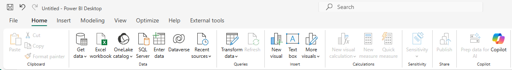
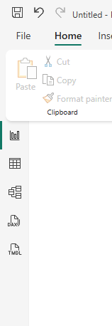
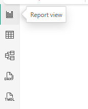
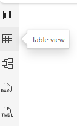
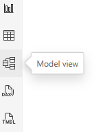
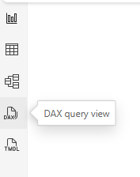
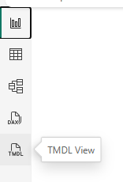
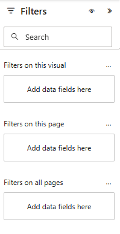
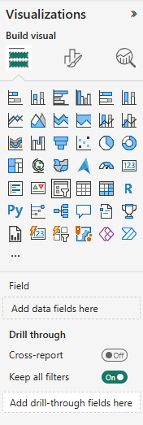
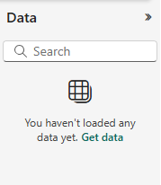

# Introduction

## Power BI Desktop

Power BI Desktop is the software that is used to do the following:

- Import data as tables.
- Build relationships between the tables.
- Add custom columns to tables
- Write measures (A measure is like a computed result that is not stored permanently)
- Create roles and row-level security on tables.
- Create data visualisations.
- Publish datasets and reports to Power BI Service (the website for others to use)

There are several prebuilt visualization components like tables, charts etc.. in Power BI Desktop. In case we need new visualizations, we can import visualizations from local files or from Power BI store into Power BI Desktop and  we can use that in our reports.

We can also run Python scripts inside Power BI. There are several other features like embedding Power Apps in Power BI reports and so on.. But at a beginner level, we will stick on these basic tasks.

## Familiarizing with the UI

### Ribbon
{: align=left }

### View Selections

{: align=left }

### Report View

{: align=left }

### Table View

{: align=left }

### Model View

{: align=left }

### DAX Query View

{: align=left }

### TMDL View

{: align=left }

### Filter Pane

{: align=left }

### Visuzliazations Pane

{: align=left }

### Data Pane

{: align=left }

